# git起源，linux创造的分布式版本管理

## 开源协议：

Apache License
使用这个协议可以进行商用
你可以对其修改、分发，但是你要声明作者来源和你的修改以及协议，很多大型项目都使用这个协议，比如 tensorflow、puppeteer。

MIT License
这是个人用得比较多的协议，因为比较宽松精简
只要声明版权和协议就可以了，可以商用、修改、复制、重新发布等操作，使用这个协议的就有vue、react等。

BSD License
这个和 MIT 协议类似除了声明协议和来源，其它基本操作都可以使用，flask 用的就是这个协议。

GNU License
你可以私用也可以商用，但是你必须声明来源，并且需要声明原有的协议以及你的代码也必须开源出来，我们很熟悉的 Linux 就是采用这种协议，现在知道为什么有那么多免费的 Linux 发行版了就是得益于这个协议。

NO License
也就是什么都不声明，但是并不意味着就可以乱来
这比声明了协议还严格，你可以使用、商用
但是你需要声明协议和来源，而且你不能对代码进行修改、复制、再次发布，不过，你在 GitHub 使用了这个协议还是可以被别人观看代码，fork 操作。

Eclipse License
这个协议允许你商用、复制、修改、再次发布等。
需要声明来源和协议，像 java 中的 junit4 就是使用这个协议。

## ssh密钥生成：

### win10生成sshkeys：

powershell > ssh-keygen -t rsa -C "邮箱名"

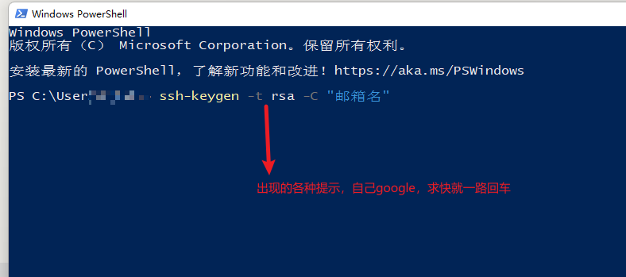

id_rsa私钥一定要保留好！！！

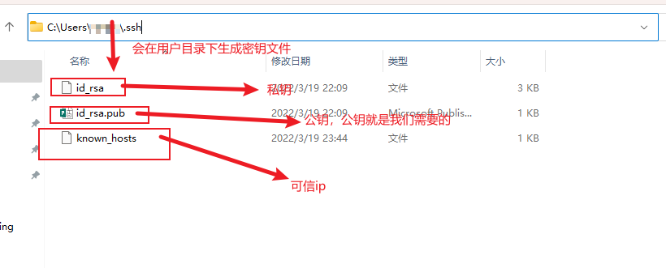

### Mac生成sshkeys：

```bash
> ssh-keygen -t rsa -b 4096 -C "xxxxxx@email.com"
```

```
# 密钥文件位置
/Users/you/.ssh/id_rsa.pub
```


### Linux生成sshkeys：

```
> ssh-keygen -t rsa -C “youremail@domain.com” 
```

```
# 密钥文件位置
vim ~/.ssh/id_rsa.pub
```

## 主流代码托管：

RCS：本地版本控制。一般是个人备份。

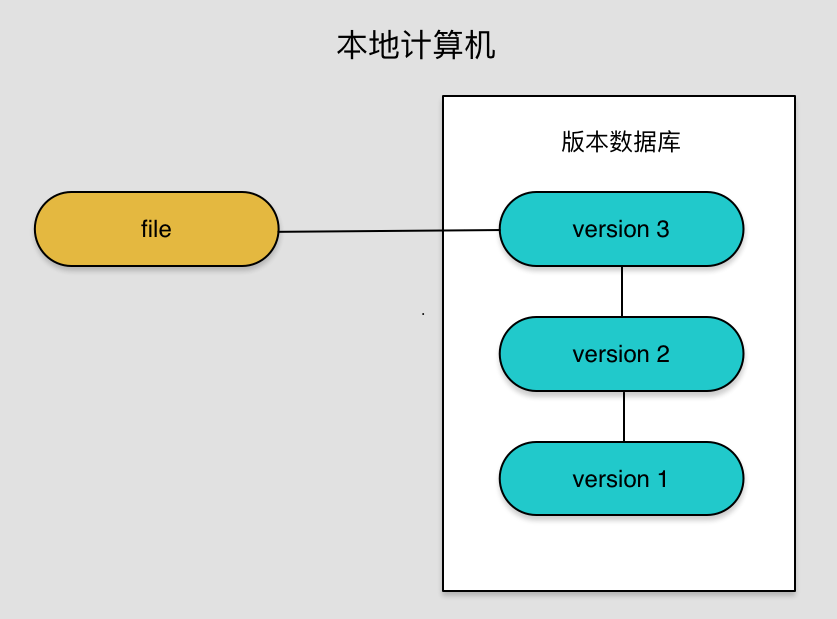

**GIT：分布式版本控制。每个人拥有全部代码，分布式保存代码。**

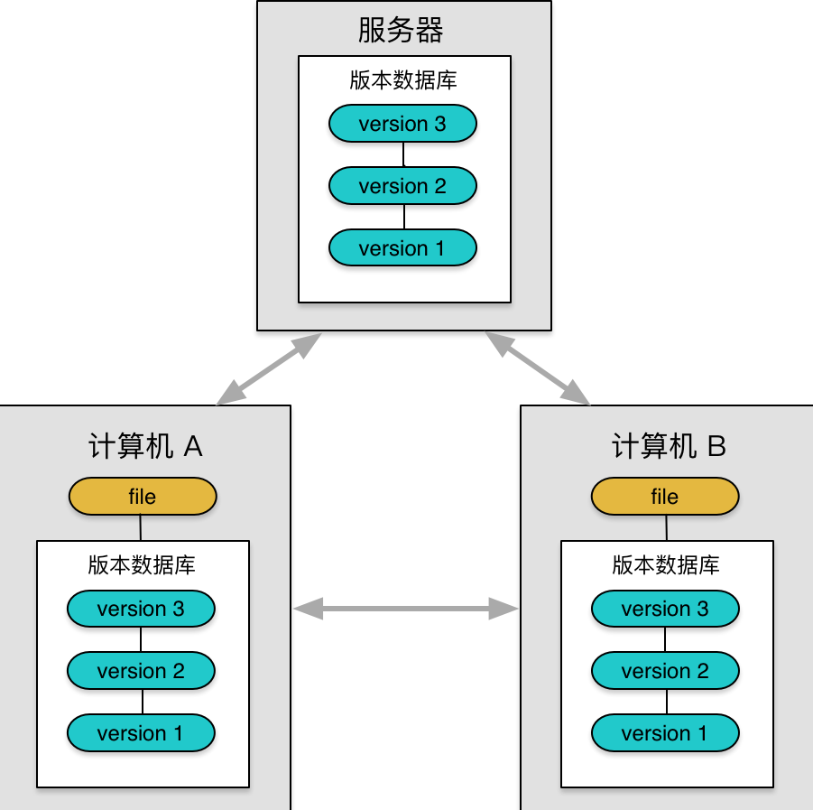

SVN ：集中式版本控制。不可靠。

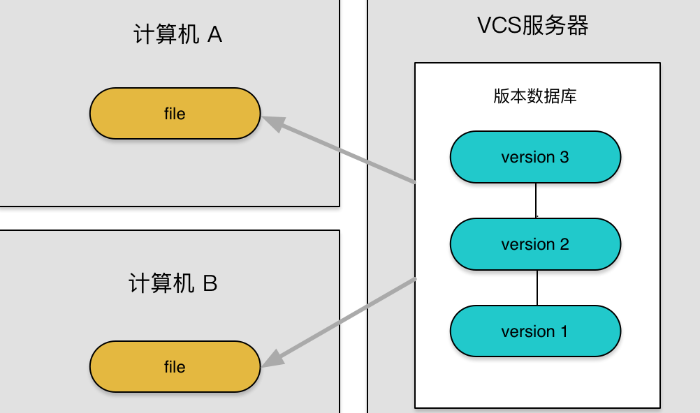

CVS： 集中式版本控制。

VSS ：集中式版本控制。

TFS ：没用过

## Github用法：

github传入密钥：

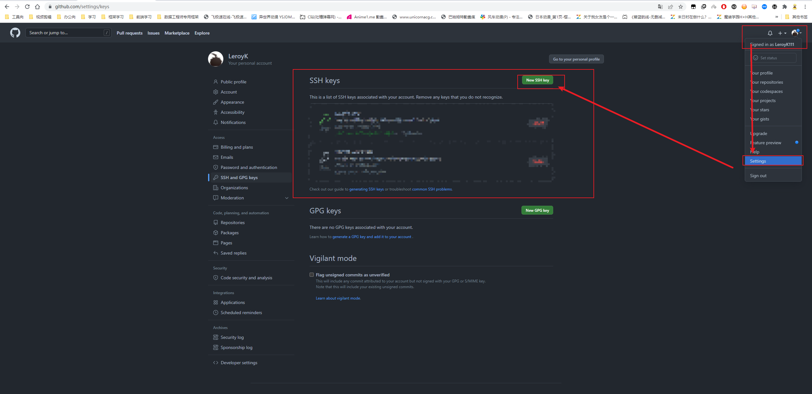

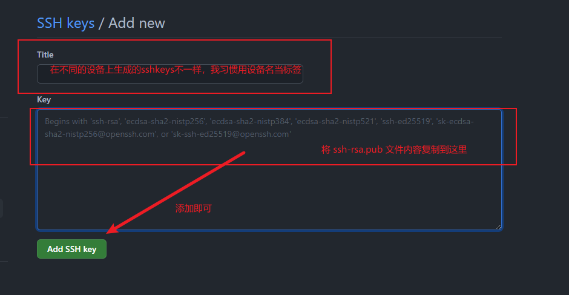

git的真正用法：


### 创建.gitignore文件

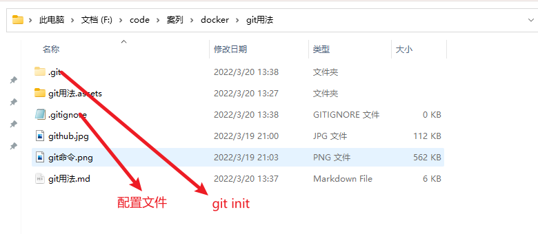

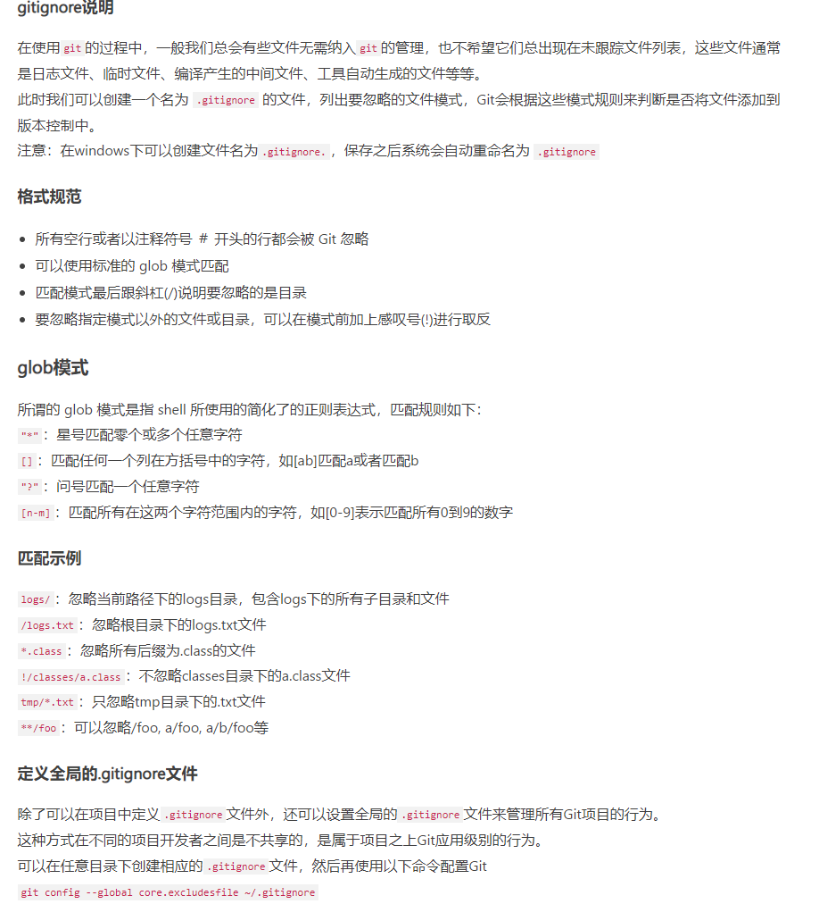

当创建.gitignore规则不生效

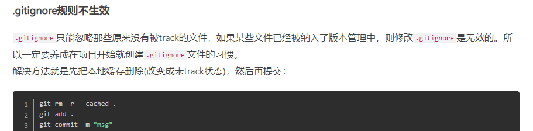


#### 示例写法：

```
# .gitignore文件放在根目录下
# 忽略后缀名为class/war/ear的文件，可以用来排除一些特定格式的文件。
*.class
*.war
*.ear
*.zip
*.tar.gz
*.rar

# 忽略target/目录下的文件
target/
build/

# 忽略当前目录下的这几个文件
.settings/
.project
.classpatch

# 忽略当前目录额下的idea/文件夹
.idea/
# 忽略根目录下的deea/文件夹
/idea/
*.ipr
*.iml
*.iws

# 忽略这些后缀文件
*.log
*.cache
*.diff
*.patch
*.tmp

# 忽略这些文件
.DS_Store
Thumbs.db
```

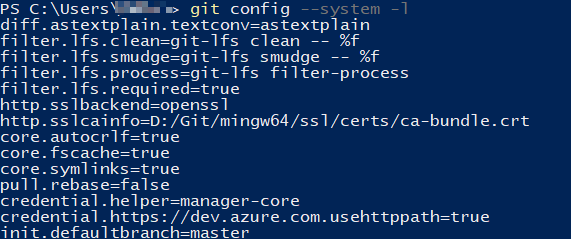

#### 主要配置：

```
# 查看所有配置
>git config -l

# 查看本地配置
>git config --global --list

# 配置本地用户
>git config --global user.name "name"
>git config --global user.email "you@qq.com"

# 如果需要特殊配置，则修改git文件
./git/etc/gitconfig
```

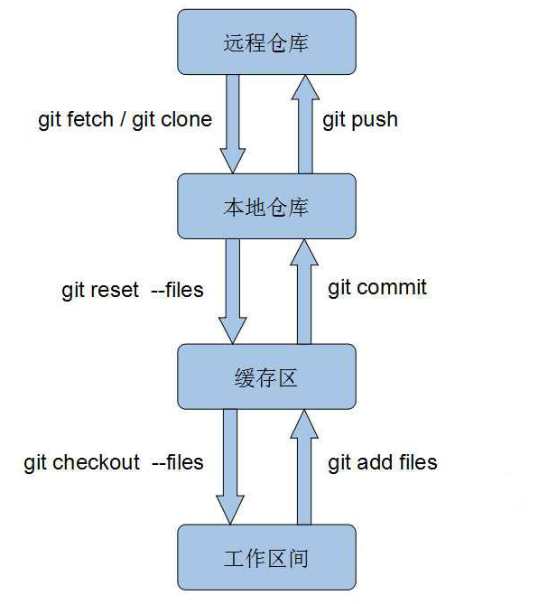

分支：主分支和分支是平行宇宙的关系，需要的时候，我们将分支合并，要么合并到主分支上，要么合并到分支上。

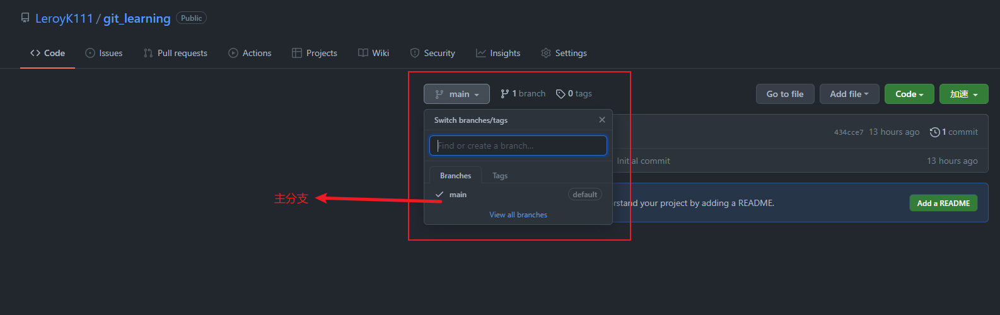

```git
一般来说，master主分支应该非常稳定，用来发布新版本。
dev 分支是开发项目。
每次将dev和master合并时，应该先把上一个版本的代码备份到版本分支上
master
dev
1.0
2.0
3.0
======================================================================
# 列出所有本地分支
$ git branch

# 列出所有远程分支
$ git branch -r

# 列出所有本地分支和远程分支
$ git branch -a

# 新建一个分支，但依然停留在当前分支
$ git branch [branch-name]

# 新建一个分支，并切换到该分支
$ git checkout -b [branch]

# 新建一个分支，指向指定commit
$ git branch [branch] [commit]

# 新建一个分支，与指定的远程分支建立追踪关系
$ git branch --track [branch] [remote-branch]

# 切换到指定分支，并更新工作区
$ git checkout [branch-name]

# 切换到上一个分支
$ git checkout -

# 建立追踪关系，在现有分支与指定的远程分支之间
$ git branch --set-upstream-to [branch] [remote-branch]

# 合并指定分支到当前分支
$ git merge [branch]
# 强制合并到某个分支上去
git merge dev --allow-unrelated-histories

# 选择一个commit，合并进当前分支
$ git cherry-pick [commit]

# 删除分支
$ git branch -d [branch-name]

# 删除远程分支
$ git push origin --delete [branch-name]
$ git branch -dr [remote/branch]
```

```
仓库
# 在当前目录新建一个Git代码库
$ git init

# 新建一个目录，将其初始化为Git代码库
$ git init [project-name]

# 下载一个项目和它的整个代码历史
$ git clone [url]
```

```
配置
# 显示当前的Git配置
$ git config --list

# 编辑Git配置文件
$ git config -e [--global]

# 设置提交代码时的用户信息
$ git config [--global] user.name "[name]"
$ git config [--global] user.email "[email address]"
```

```
增加/删除文件
# 添加指定文件到暂存区
$ git add [file1] [file2] ...

# 添加指定目录到暂存区，包括子目录
$ git add [dir]

# 添加当前目录的所有文件到暂存区
$ git add .

# 添加每个变化前，都会要求确认
# 对于同一个文件的多处变化，可以实现分次提交
$ git add -p

# 删除工作区文件，并且将这次删除放入暂存区
$ git rm [file1] [file2] ...

# 停止追踪指定文件，但该文件会保留在工作区
$ git rm --cached [file]

# 改名文件，并且将这个改名放入暂存区
$ git mv [file-original] [file-renamed]
```

```
代码提交
# 提交暂存区到仓库区
$ git commit -m [message]

# 提交暂存区的指定文件到仓库区
$ git commit [file1] [file2] ... -m [message]

# 提交工作区自上次commit之后的变化，直接到仓库区
$ git commit -a

# 提交时显示所有diff信息
$ git commit -v

# 使用一次新的commit，替代上一次提交
# 如果代码没有任何新变化，则用来改写上一次commit的提交信息
$ git commit --amend -m [message]

# 重做上一次commit，并包括指定文件的新变化
$ git commit --amend [file1] [file2] ...
```

```
标签
# 列出所有tag
$ git tag

# 新建一个tag在当前commit
$ git tag [tag]

# 新建一个tag在指定commit
$ git tag [tag] [commit]

# 删除本地tag
$ git tag -d [tag]

# 删除远程tag
$ git push origin :refs/tags/[tagName]

# 查看tag信息
$ git show [tag]

# 提交指定tag
$ git push [remote] [tag]

# 提交所有tag
$ git push [remote] --tags

# 新建一个分支，指向某个tag
$ git checkout -b [branch] [tag]
```

```
查看信息
# 显示有变更的文件
$ git status

# 显示当前分支的版本历史
$ git log

# 显示commit历史，以及每次commit发生变更的文件
$ git log --stat

# 搜索提交历史，根据关键词
$ git log -S [keyword]

# 显示某个commit之后的所有变动，每个commit占据一行
$ git log [tag] HEAD --pretty=format:%s

# 显示某个commit之后的所有变动，其"提交说明"必须符合搜索条件
$ git log [tag] HEAD --grep feature

# 显示某个文件的版本历史，包括文件改名
$ git log --follow [file]
$ git whatchanged [file]

# 显示指定文件相关的每一次diff
$ git log -p [file]

# 显示过去5次提交
$ git log -5 --pretty --oneline

# 显示所有提交过的用户，按提交次数排序
$ git shortlog -sn

# 显示指定文件是什么人在什么时间修改过
$ git blame [file]

# 显示暂存区和工作区的差异
$ git diff

# 显示暂存区和上一个commit的差异
$ git diff --cached [file]

# 显示工作区与当前分支最新commit之间的差异
$ git diff HEAD

# 显示两次提交之间的差异
$ git diff [first-branch]...[second-branch]

# 显示今天你写了多少行代码
$ git diff --shortstat "@{0 day ago}"

# 显示某次提交的元数据和内容变化
$ git show [commit]

# 显示某次提交发生变化的文件
$ git show --name-only [commit]

# 显示某次提交时，某个文件的内容
$ git show [commit]:[filename]

# 显示当前分支的最近几次提交
$ git reflog
```

```
远程同步
# 下载远程仓库的所有变动，默认主分支master
$ git fetch [remote]

# 拉取远程分支
$ git fetch [remote] [branch]

# 同步远程分支
$ git switch -t [Local branch] origin/[remote branch]

# 显示所有远程仓库
$ git remote -v

# 显示某个远程仓库的信息
$ git remote show [remote]

# 增加一个新的远程仓库，并命名
$ git remote add [shortname] [url]

# 取回远程仓库的变化，并与本地分支合并
$ git pull [remote] [branch]

# 上传本地指定分支到远程仓库
$ git push [remote] [branch]

# 强行推送当前分支到远程仓库，即使有冲突
$ git push [remote] --force

# 推送所有分支到远程仓库
$ git push [remote] --all
```

```
撤销
# 恢复暂存区的指定文件到工作区
$ git checkout [file]

# 恢复某个commit的指定文件到暂存区和工作区
$ git checkout [commit] [file]

# 恢复暂存区的所有文件到工作区
$ git checkout .

# 重置暂存区的指定文件，与上一次commit保持一致，但工作区不变
$ git reset [file]

# 重置暂存区与工作区，与上一次commit保持一致
$ git reset --hard
# 回退上一个版本
$ git reset --hard HEAD^
# 回退上两个版本
$ git reset --hard HEAD^^
# 回退上100个版本
$ git reset --hard HEAD~100
# 回退版本reset常与下面指令配合
$ git reflog
$ git log

# 重置当前分支的指针为指定commit，同时重置暂存区，但工作区不变
$ git reset [commit]

# 重置当前分支的HEAD为指定commit，同时重置暂存区和工作区，与指定commit一致
$ git reset --hard [commit]

# 重置当前HEAD为指定commit，但保持暂存区和工作区不变
$ git reset --keep [commit]

# 新建一个commit，用来撤销指定commit
# 后者的所有变化都将被前者抵消，并且应用到当前分支
$ git revert [commit]

暂时将未提交的变化移除，稍后再移入
$ git stash
$ git stash pop
```

```
其他
# 生成一个可供发布的压缩包
$ git archive
```

##### sparse-checkout用法

```
# 设置允许git克隆子目录
git config core.sparsecheckout true

# 创建本地空repo
git init myRepo && cd myRepo

# 设置要克隆的仓库的子目录路径, “*” 是通配符，“!” 是反选
echo deployment >> .git/info/sparse-checkout

# 设置远程仓库地址
git remote add origin ssh://github.com/abc.git

# 用 pull 来拉取代码
git pull origin master

#############################
# 如果需要添加目录，就增加sparse-checkout的配置，再checkout master
echo another_folder >> .git/info/sparse-checkout
git checkout master
```

### 其他

```
>git --help
```

```
start a working area (see also: git help tutorial)
   clone             直接复制master or main下全部内容
   init              创建.git文件夹

work on the current change (see also: git help everyday)
   add               加入缓存区
   mv                移动或者重命名
   restore           回退版本
   rm                删除版本
   sparse-checkout   类似.gitignore不过是命令的形式

examine the history and state (see also: git help revisions)
   bisect            使用二分法找错误的提交
   diff              比较缓存区和工作区的差异
   grep              查询工作区内容
   log               查询工作区提交历史
   show              展示对象，文件名， 内容，标记等等
   status            查询缓存区状态

grow, mark and tweak your common history
   branch            分支操作
   commit            提交暂存区到工作区
   merge             分支合并，合并差异
   rebase            合并某个分支到当前分支上
   reset             回退版本
   switch            切换分支，新命令
   tag               标记操作
   checkout          切换分支

collaborate (see also: git help workflows)
   fetch             从远程获取代码库，这个需要仓库权限（一般是加了自己sshkey）
   pull              拉取自己的github仓库
   push              推送自己到自己github仓库


```


